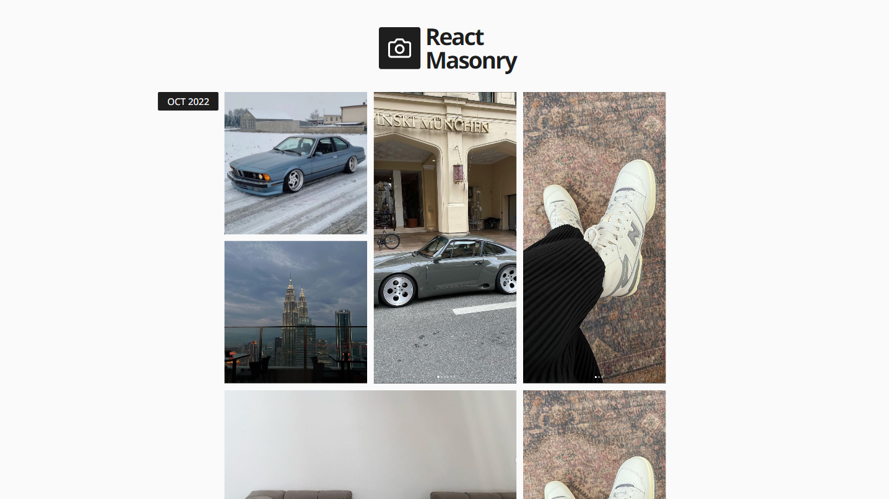

# React + Typescript Masonry

> A Responsve Masonry built using React + Tailwind. (Optional: Contentful as Headless CMS)

## 🚀 Objective

> To build a responsive photo blog masonry with React + Tailwind.

## 📸 Screenshots

<ul style="display:flex flex-direction:column">
 

    
    


</ul>

### Mobile Design

<ul style="display:flex">
  
  
  
  
</ul>

## ⚙ Technologies

-  React
-  Typescript
-  Contentful


## 🛠 Installation and Setup

Clone down this repository. You will need node and npm installed globally on
your machine.

```
$ git clone https://github.com/jonathancarpena/react-typescript-masonry.git
```

1. Install project folder `npm install`

### Environment Variables

To run this project, you will need to add the following environment variables to
your `.env` file inside the server folder.

`REACT_APP_CONTENTFUL_SPACE_ID`: Retrieve SpaceID from your Contentful settings

`REACT_APP_CONTENTFUL_ACCESS_TOKEN`: Retrieve Access Token from your Contentful settings

### Scripts

Development mode. Open http://localhost:3000 to view it in the browser.

```
npm run start
```
